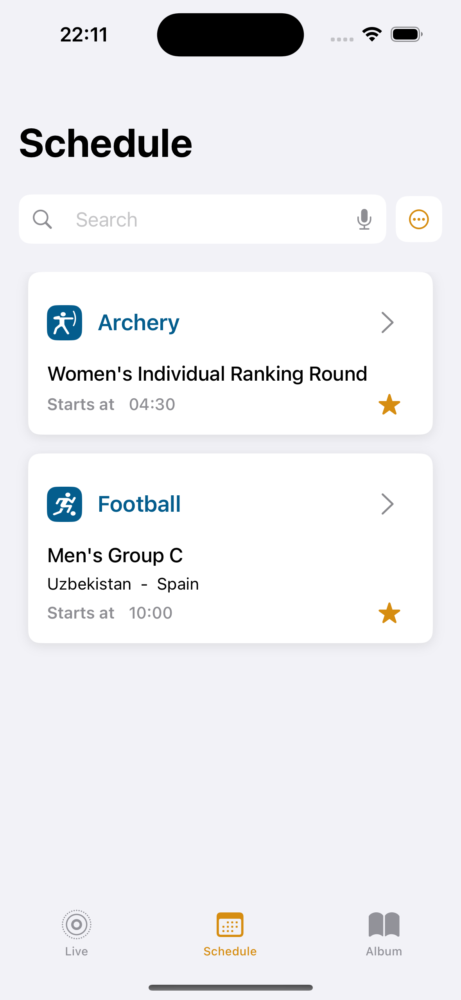
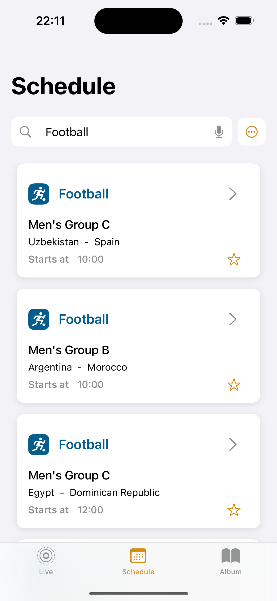
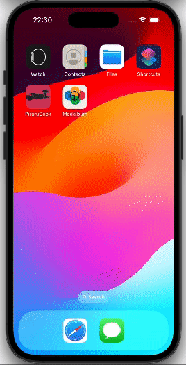

# Olympics Schedule App

<div align="center">
  
</div>

This repository contains a study application developed to evaluate the behavior of the API that powers the schedule of the 2024 Olympics games. The application was built using SwiftUI to implement an interactive interface that allows users to see the games happening now and throughout the day.

## Overview

The Olympics Schedule App consumes an API that returns data in JSON format about the 2024 Olympics games. The API provides detailed information about schedules, sports, groups, venues, and medals.

## Study Focus

This study focused on how to handle the request, manipulate the JSON to extract only the necessary information. The API used is a GET-only API.

## Features

- **Daily Schedule:** Check out the games scheduled throughout the day.
- **Filter by Sport:** Filter games by sport.
- **Favorites:** Mark and filter your favorite games for easy access.
- **Detailed Navigation:** Navigate to see additional details about each game, including team and venue information.

## Technologies Used

- **SwiftUI:** Used to build an interactive and responsive user interface.
- **Combine:** Used to manage asynchronous and reactive data.
- **URLSession:** Used to make HTTP requests and consume the API.

## Project Structure

- **Models:** Contains the data structures that represent the information received from the API.
- **Views:** Contains the SwiftUI views that make up the user interface.
- **ViewModels:** Contains the business and presentation logic, managing communication between Views and Models.

## Screenshots

<div align="center">
  
  
  
  
</div>

## How to Run the Project

1. Clone the repository:
    ```sh
    [git clone https://github.com/your-username/olympics-schedule-app.git](https://github.com/brunooohd/Medalbum.git)
    ```

2. Open the project in Xcode:
    ```sh
    cd olympics-schedule-app
    open OlympicsScheduleApp.xcodeproj
    ```

3. Run the application on a simulator or device:
    - Select the desired device in Xcode.
    - Press `Cmd + R` to build and run the application.

## API Used

The API used in this project provides detailed information about the schedule of the 2024 Olympics games. For more details about the API, refer to the [official API documentation](https://olympics.com).

## License

This project is licensed under the MIT License. 


---

Thank you for checking out this project! We hope you find it useful and informative.
